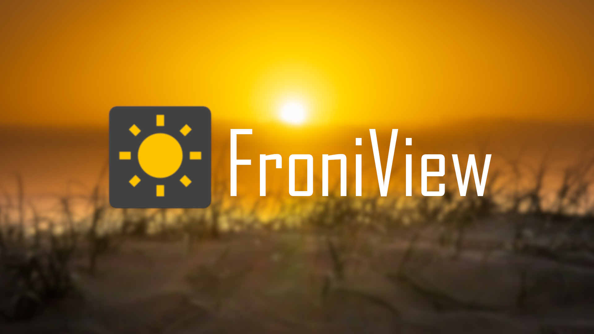

# FroniView | Scriptable

This respository was migrated to GitLab: [https://gitlab.com/neidigsi/widgets](https://gitlab.com/neidigsi/widgets)!

FroniView is an OpenSource application that allows all owners of a "Fronius" inverter to view the energy generated by the solar system without having to go through a third-party server. 

With some small changes in the backend is an use of others firm's inverters possible! 

## iPhone-Widget
This repository contains the implementation of a widget for the iOS app "[Scriptable](https://scriptable.app)".

The widget displays the current output of the Fronius solar system as well as the target value for the day.

The adjustment to the iPhone-wide light and dark mode is done automatically, as can be seen on the screenshots below.

 &nbsp;  

## Preconditions
The script uses a connection to a RESTful API as implemented in this repository:
[Froniview | Backend](https://github.com/neidigsi/froniview_backend)
